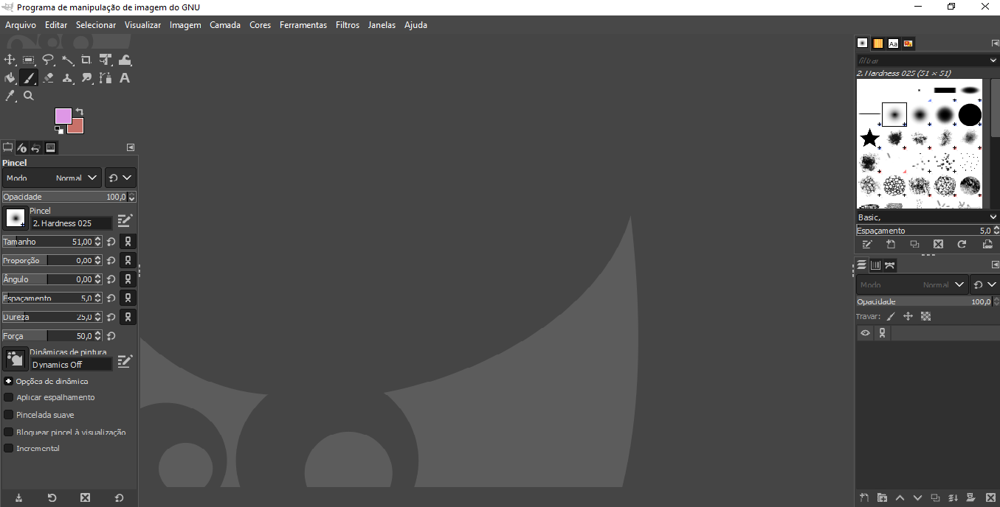
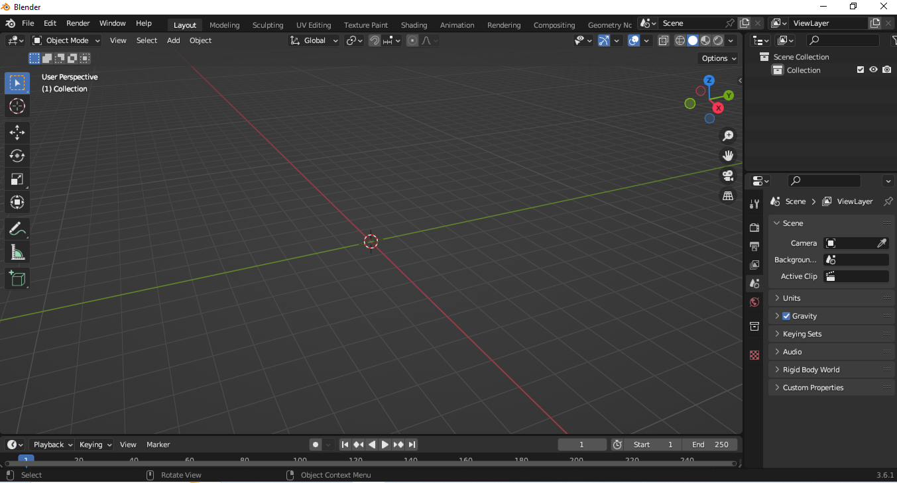
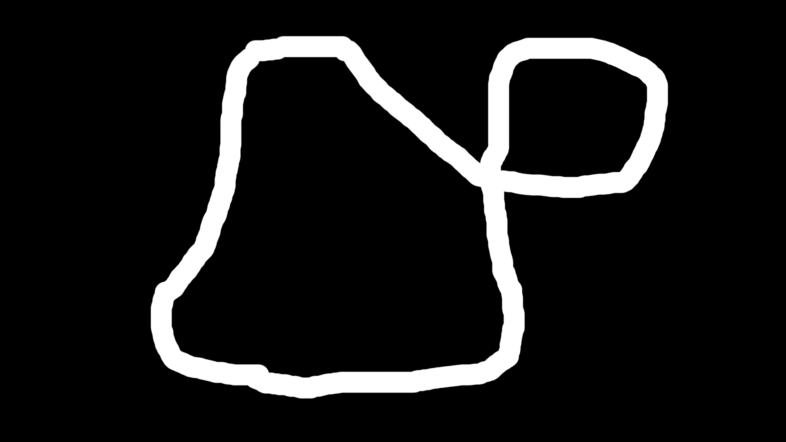
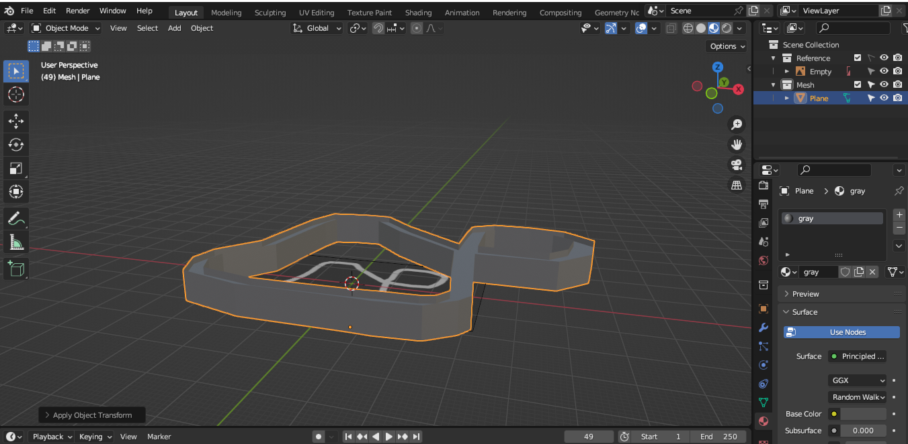
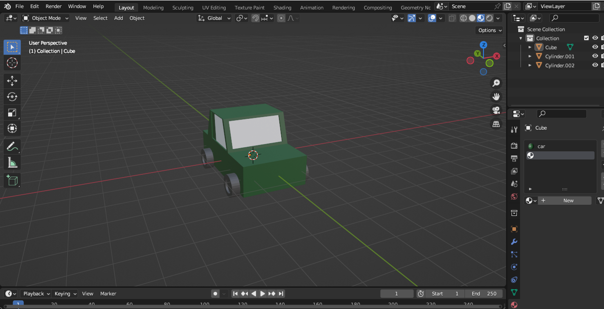
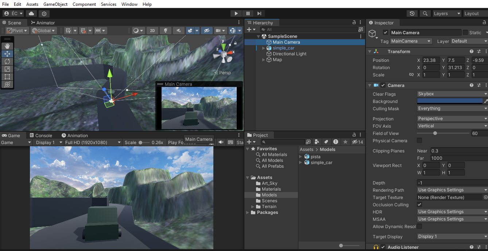

<h1 style = "text-align:center">Simple Game Car</h1>


## Índice
- <a href="#Introducao">Introdução</a>

- <a href="#configuracoes">Configurações iniciais</a>

- <a href="#scriptdocarro">Script do carro</a>

## Introdução
<p>
Esse projeto aborda o desenvolvimento de uma simples corrida de carro.
</p>

## Configurações Iniciais

<p>
Criou-se um novo projeto na Unity3D. Após criado o projeto,para uma melhor organização criou-se novas pastas como os nomes: <b>Art, Scripts, Audio</b>
</p>

<p>
Para a criação das arts utilizou-se os softwares GIMP e Blender ambos grátis e disponíveis para download.

Gimp


Blender


No Gimp foi desenhado um simples formata da pista e no Blender sua modelagem.



A próxima modelagem a ser feita será um simples modelo de um veículo.

</p>

<p>
Após a criação dos modelos adione-os à cena na Unity. Modifique a posição da camera para que ela fique atrás do carro.



Adicione Physics para o carro além de um collider. Nesse casso um Rigidbody e Box Collider e a mass no Rigidbody para o.3 e clik no Play para ver se o carro fica estático. Confira se a pista também  possui um cillider , nela foi utilizado um Mesh Collider.
</p>

## Script do carro

<p>
Na pasta Script, crie um script para controlar o carro, por exemplo <i>CarroController.cs</i> e adicione esse script ao objeto carro na cena.

```c++
public class CarroController : MonoBehaviour
{
    Rigidbody rb ;

    void Start()
    {
        rb = GetComponent<Rigidbody>();  
    }

    void Update()
    {
        rb.freezeRotation = true;

        if(Input.GetKey("right"))
        {
            transform.Rotate(Vector3.up, 0.5f);
        }
        else if(Input.GetKey("left"))
        {
            transform.Rotate(Vector3.up, -0.5f);
        }
    }
}
```
A variável rb será responsável por acessar o Rigidbody para aplicar alguma física no carro que nesse caso será a movimentação. Ela deve ser iniciada na função Start(). Na função Update(), pegamos a entrada do teclado das setas para rotacionar o carro para a esquerda o direita.

```c++
...
if(Input.GetKey("space"))
{
    rb.AddForce(10.0f * (transform.rotation * Vector3.forward));
}
```

Agora aplicando força ao carro pressionando a tecla space, a força o direciona para onde o objeto está apontando.

O próximo script será para a camera seguir o carro. Crie o script <i>CameraController</i> na pasta Scripts e adicione-o à camera.

```c++
    public Transform target;
    public float smoothSpeed = 0.125f;
    public Vector3 locationOffset;
    public Vector3 rotationOffset;

    void FixedUpdate()
    {
        
        Vector3 desiredPosition = target.position + target.rotation * locationOffset;
        Vector3 smoothedPosition = Vector3.Lerp(transform.position, desiredPosition, smoothSpeed);
        transform.position = smoothedPosition;

        Quaternion desiredrotation = target.rotation * Quaternion.Euler(rotationOffset);
        Quaternion smoothedrotation = Quaternion.Lerp(transform.rotation, desiredrotation, smoothSpeed);
        transform.rotation = smoothedrotation;
    }
```
A variável <i>Transform</i> pega o tranform do objeto a ser seguido. Nesse caso o objeto carro na interface e unity deve ser arrastado até onde se encontra essa variável. A variável <i>smoothSpeed</i> é a veriável de velocidade. As outras variáveis são responáveis pela capitura dos eixos x,y e z tanto na rotação como na direção.

Quaternion usado para representar rotações.
</p>


